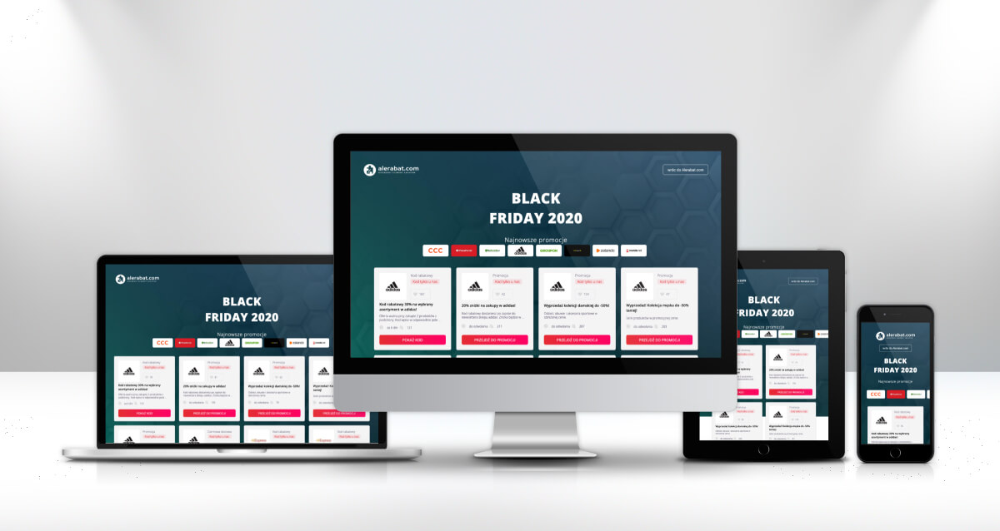
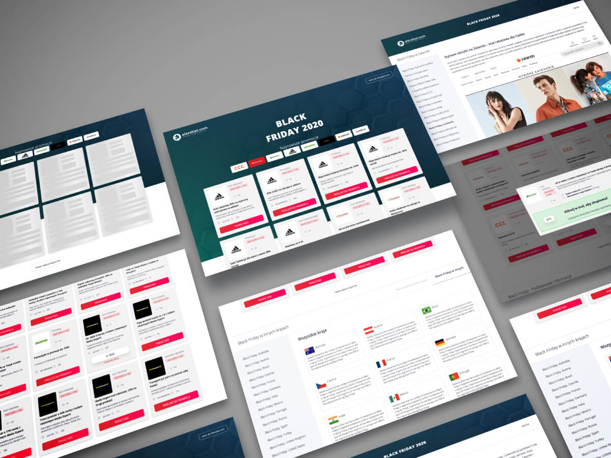

# Black Friday Coupon Apps 💸

## General info

> If you want to save money while shopping, this coupon app is a great way to save money efficiently and effectively. 💰 😀

Responsive React application for finding discount codes and promotions for online shopping on Black Friday.

- based on a design in Zeplin
- bootstrapped with Create React App.

## Live demo

[black-friday-discounts.netlify.app](https://black-friday-discounts.netlify.app/)

Login: lukasz.kopyto@gmail.com

Password: test123

## Technologies

- React, based on:
  - Hooks,
  - Context API
- React-router
- Axios (HTTP Request)
- Styled-components
- Moment.js
- Netlify

## Features

- Responsive Web Design
- The number of coupons displayed on the home page depends on the width of the screen.
- "Show more" button to load more vouchers.
- Carousel slider with links to individual subpages (stores)
- Skeleton screen for vouchers (a placeholder to display an animation before the API data is retrieved)
- Changing the menu item depends on the active tab
- Displaying coupons based on data taken from the API
- Displaying coupon details on a popup, after clicking the coupon button (popup only for desktop and tablet view)
- Copying the coupon code to the clipboard
- Retrieving the coupon finish date (UTC time date format) from the API and displaying it in a human-readable time frame (using Moment js)
- Fetch data using axios:
  - Receive an access token to authorize next request
  - Retrieving coupon data from one endpoint based on an ID retrieved from another endpoint
  - Transform response (filtering and mapping large list of ID's) before Axios return response
  - Making simultaneous requests

## Setup

In the project directory, you can run:

### `npm start`

Runs the app in the development mode. 
Open [http://localhost:3000](http://localhost:3000) to view it in the browser.

The page will reload if you make edits. 
You will also see any lint errors in the console.

### `npm run build`

Builds the app for production to the `build` folder. 
It correctly bundles React in production mode and optimizes the build for the best performance.
